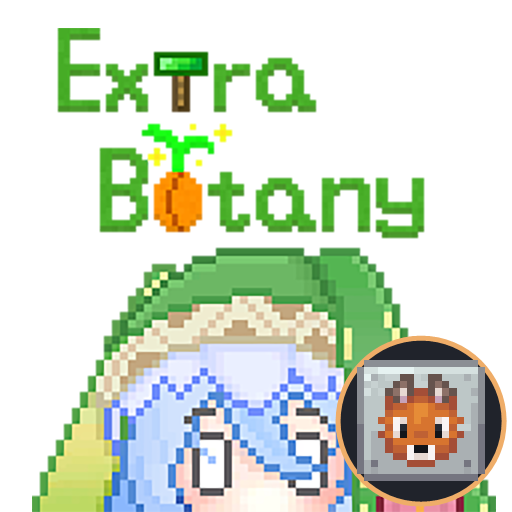

# ExtraBotany — Unofficial NeoForge Port

An unofficial port of **ExtraBotany for Minecraft 1.21.1 / NeoForge**.

Requires **Java 21, Patchouli, Curios**, and [our Botania port](https://github.com/Kirillich611/Botania-Unofficial-NeoForge-Port).

Original mod by **Lounode and the ExtraBotany contributors**. Distributed under the [MIT License](LICENSE), with original copyright notices preserved.

Original project: [GitHub](https://github.com/Lounode/Extrabotany) | [Modrinth](https://modrinth.com/mod/extrabotany) | [CurseForge](https://www.curseforge.com/minecraft/mc-mods/extrabotany-reburn).

Want a port for another Minecraft version? Open an [issue](https://github.com/Kirillich611/ExtraBotany-Unofficial-NeoForge-Port/issues).
